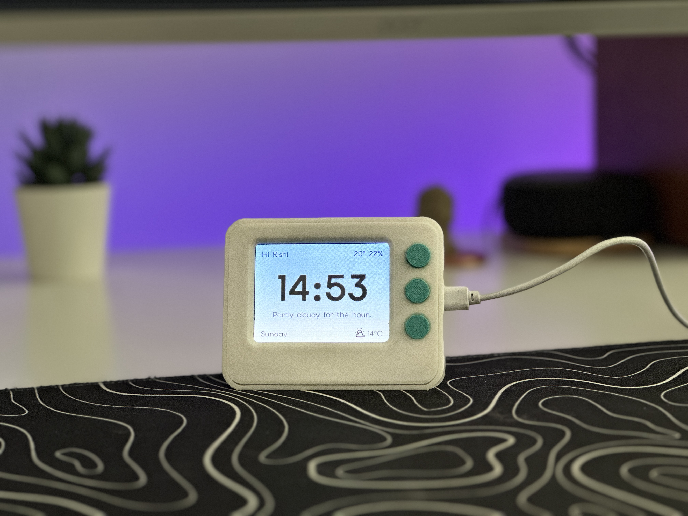
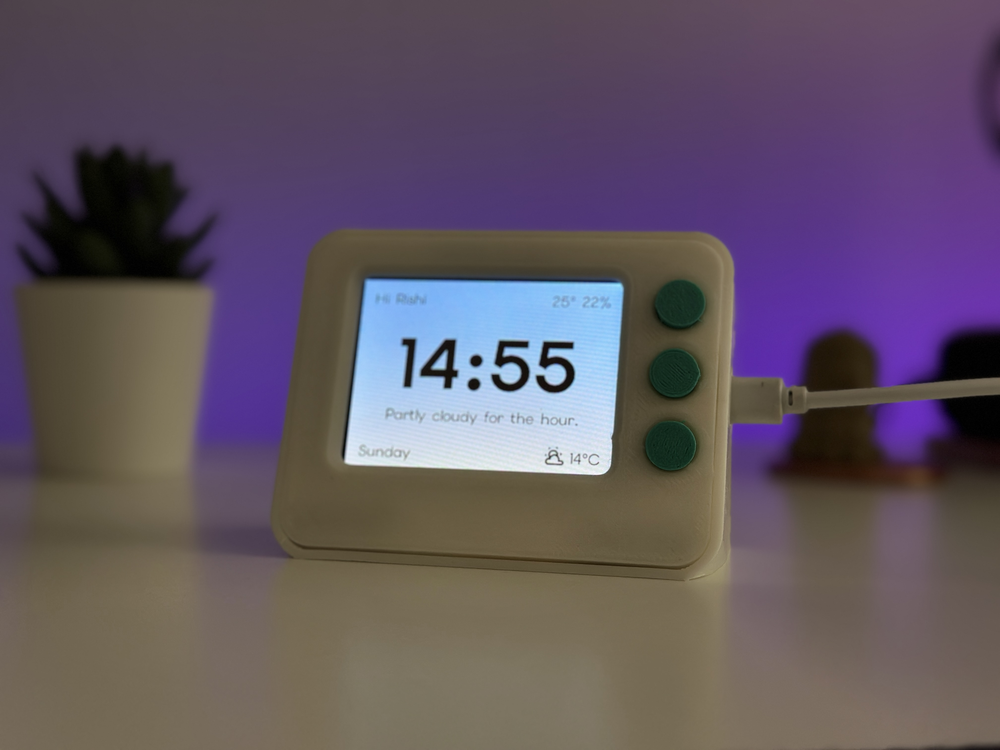
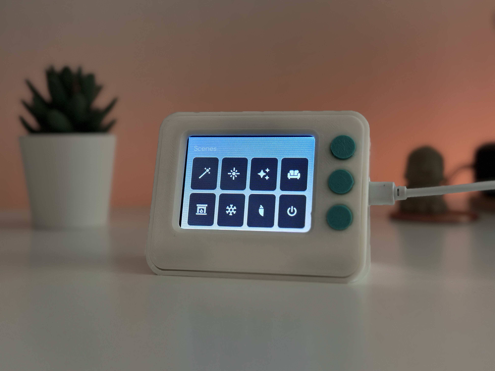
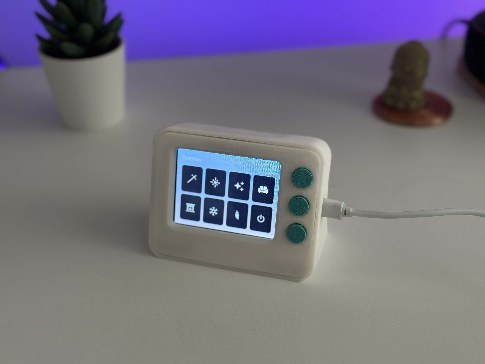
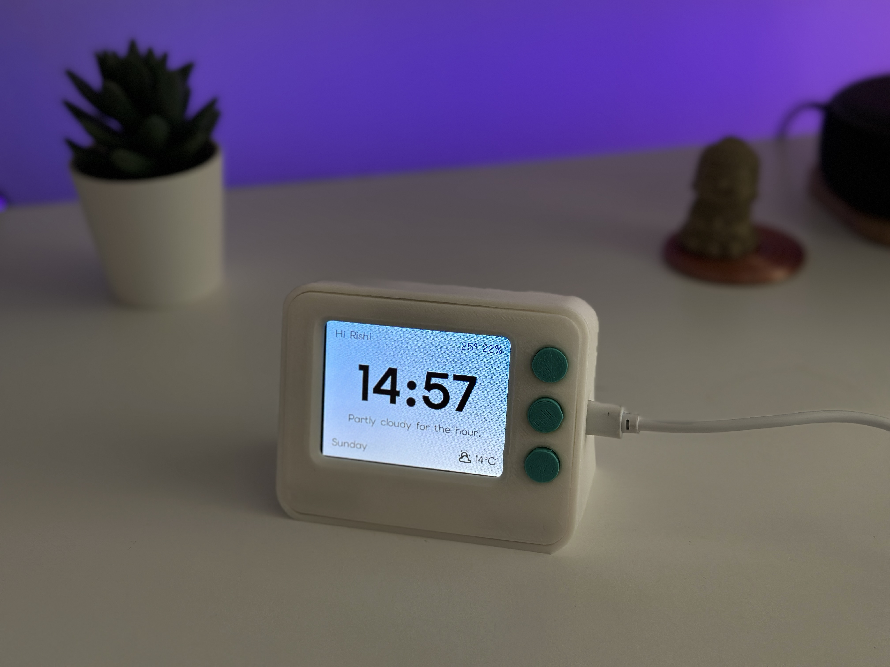

# CYD Docky

A smart desk dock powered by the Cheap Yellow Display (CYD) ESP32-2432S028, built with ESPHome, LVGL, and Home Assistant.

## Gallery


| Docky detail | Display view | Hardware view |
| --- | --- | --- |
|  |  |  |
|  |  | |

## Repository Layout

```text
docky-esphome-lvgl/
├── docky.yaml
├── secrets.yaml.example
├── .gitignore
├── THIRD_PARTY_NOTICES.md
├── docs/
│   └── images/                               # README photos/GIF
├── fonts/
│   ├── README.md
│   └── materialdesignicons-webfont.ttf        # you add this
└── images/
    ├── README.md
    ├── background.png                         # you add this
    └── background_night.png                   # you add this
```

## What to commit to GitHub

Commit these:

```text
docky.yaml
secrets.yaml.example
.gitignore
README.md
THIRD_PARTY_NOTICES.md
docs/images/
fonts/README.md
images/README.md
images/background.png and images/background_night.png, if they are your images or you have rights to share them
fonts/materialdesignicons-webfont.ttf, if you are comfortable redistributing it and include the license/notice
```

Do not commit these:

```text
secrets.yaml
.esphome/
firmware binaries such as *.bin, *.elf, *.map, *.uf2
logs/
```

## Setup

1. Clone or copy this repo into your ESPHome config directory.

   Example:

   ```bash
   cd /root/config
   git clone <your-github-repo-url> docky-esphome-lvgl
   cd docky-esphome-lvgl
   ```

2. Copy your downloaded MDI webfont into the repo:

   ```bash
   cp /root/config/fonts/materialdesignicons-webfont.ttf fonts/materialdesignicons-webfont.ttf
   ```

3. Add your background images:

   ```bash
   cp /root/config/images/background.png images/background.png
   cp /root/config/images/background_night.png images/background_night.png
   ```

   Best result: crop/export them as exactly 320x240.

4. Create your local secrets file:

   ```bash
   cp secrets.yaml.example secrets.yaml
   nano secrets.yaml
   ```

5. Validate and upload with ESPHome:

   ```bash
   esphome config docky.yaml
   esphome run docky.yaml
   ```

## Pages

Docky has four LVGL pages:

```text
Home
Scenes
Transport
Washing Machines
```

The Home page shows time, greeting, indoor temperature/humidity, weather summary, weather icon, outdoor temperature, and day of week. It uses the sun state to switch between the day and night background images.

The Scenes page shows an icon grid for bedroom lighting scene presets plus a power toggle. Scene buttons call a Home Assistant script that applies a preset to a light target.

The Transport page shows the next S1 departure as one large card with line badge, ETA, delay/status, and direction.

The Washing Machines page shows washing machine status cards. Available machines are muted, occupied machines are red with a shaking washer icon, and stoppable/user-owned washes are yellow with an alert icon.

## Home Assistant Data

The YAML uses Home Assistant data by role. If your entity names differ, edit the matching `entity_id` values in `docky.yaml`.

```text
Sun state
- Powers day/night theme switching.
- Expected state values: above_horizon or below_horizon.

Weather provider
- Powers weather condition icon, weather summary text, and outdoor temperature.
- Needs a weather entity or sensors with equivalent condition, summary, and temperature data.

Indoor climate sensors
- Power the top-right header readout.
- Needs indoor temperature and/or humidity sensors.

Transport sensor
- Powers the Transport page.
- Needs minutes-until, delay, and direction data for the next departure.

Washing machine sensors
- Power the Washing Machines page.
- Expected states: AVAILABLE, OCCUPIED, STOPPABLE.

Scene script
- Powers scene preset buttons.
- Receives a preset id, target light entity, shuffle flag, and smart-shuffle flag.

Light target
- The scene page currently controls one room/light target through Home Assistant.
```

## Home Assistant Controls Exposed

Docky exposes these controls back to Home Assistant:

```text
Docky Backlight
- Brightness control for the LCD backlight on GPIO21.

Docky RGB LED
- RGB control for the onboard CYD rear RGB LED.

Docky Home
Docky Scenes
Docky Transport
Docky Washing
- Pressable buttons to switch LVGL pages remotely.

Docky Rotate Display
- Cycles the LVGL display rotation through 90, 180, 270, and 0 degrees.

Docky Ambient Light
- ADC reading from GPIO34, useful for testing the onboard light sensor/LDR.
```

## Physical Buttons And Wiring

The display uses two external navigation buttons.

```text
GPIO22 button
- Wire one side of the button to GPIO22.
- Wire the other side to GND.
- Uses the ESP32 internal pull-up.
- Short press: opens Scenes from Home, or returns Home from any secondary page.
- Long press: opens Transport from Home, or returns Home from any secondary page.

GPIO27 button
- Wire one side of the button to GPIO27.
- Wire the other side to GND.
- Uses the ESP32 internal pull-up.
- Press: opens Washing Machines from Home, or returns Home from any secondary page.
```

GPIO21 is exposed on some CYD headers, but on this board it is used for the LCD backlight. Treat it as reserved unless you are intentionally modifying the hardware.

GPIO35 is input-only and has no internal pull-up or pull-down. It is better suited for analog input, such as a 10k potentiometer, than for a plain button.

## Board Pins Used

```text
LCD SPI
- GPIO14: LCD clock
- GPIO13: LCD MOSI
- GPIO15: LCD chip select
- GPIO2: LCD data/command
- GPIO12: LCD reset

Touch SPI
- GPIO25: touch clock
- GPIO32: touch MOSI
- GPIO39: touch MISO
- GPIO33: touch chip select
- GPIO36: touch interrupt

Backlight
- GPIO21: PWM backlight output

Onboard RGB LED
- GPIO4: red channel
- GPIO16: green channel
- GPIO17: blue channel

Inputs
- GPIO22: main navigation button
- GPIO27: washing page button
- GPIO34: ambient light ADC
```

## Git commands for first push

```bash
git init
git add .
git status
git commit -m "Add Docky ESPHome LVGL display config"
git branch -M main
git remote add origin <your-github-repo-url>
git push -u origin main
```

Before running `git commit`, check that `secrets.yaml` is not listed in `git status`.
